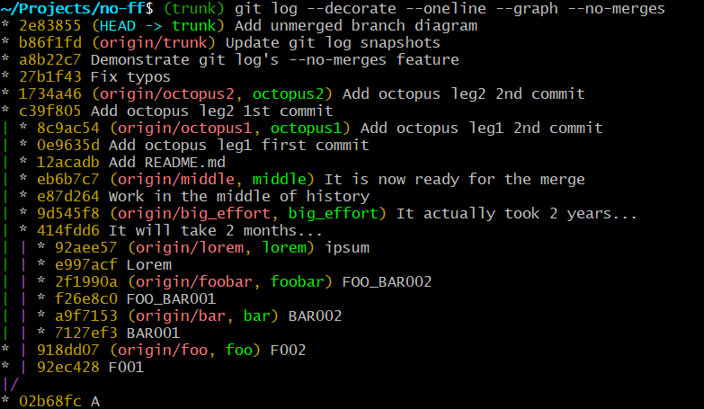

# Git --no-ff demo

The purpose of this repository is to demonstrate the git's `--no-ff` feature,
and prove that it does not break the `git bisect` feature since git's version
2.29 thanks to `--first-parent` flag.

Feel free to experiment with this initial setup, so that you can get all the
pros and cons of the non-linear git history.

I can also strongly recommend [this](https://gist.github.com/canton7/3737126)
`gist` as it makes some really good points.

## git log

The repository consist of the following commits:


As you can see there are feature branches being merged to the `trunk`, including
the branches that diverted long time ago as e.g. `big_effort` and `middle`
branches.

### --no-merges

If you want to see a full history of the `trunk` but exclude the merge commits
you can use git log's `--no-merges` feature as presented below:



It is also possible to print a flat history:

```bash
~/Projects/no-ff$ (trunk) git log --oneline --no-merges
2e83855 (HEAD -> trunk) Add unmerged branch diagram
b86f1fd (origin/trunk) Update git log snapshots
a8b22c7 Demonstrate git log --no-merges feature
27b1f43 Fix typos
1734a46 (origin/octopus2, octopus2) Add octopus leg2 2nd commit
c39f805 Add octopus leg2 1st commit
8c9ac54 (origin/octopus1, octopus1) Add octopus leg1 2nd commit
0e9635d Add octopus leg1 first commit
12acadb Add README.md
eb6b7c7 (origin/middle, middle) It is now ready for the merge
e87d264 Work in the middle of history
9d545f8 (origin/big_effort, big_effort) It actually took 2 years...
414fdd6 It will take 2 months...
92aee57 (origin/lorem, lorem) ipsum
e997acf Lorem
2f1990a (origin/foobar, foobar) FOO_BAR002
f26e8c0 FOO_BAR001
a9f7153 (origin/bar, bar) BAR002
7127ef3 BAR001
918dd07 (origin/foo, foo) F002
92ec428 F001
02b68fc A
```

### --first-parent

If you want to see a flat history of the `trunk` branch but exclude the feature
development details you can use git log's `--first-parent` feature as presented
below:

```bash
~/Projects/no-ff$ (trunk) git log --oneline --first-parent
2e83855 (HEAD -> trunk) Add unmerged branch diagram
b86f1fd (origin/trunk) Update git log snapshots
a8b22c7 Demonstrate git log --no-merges feature
27b1f43 Fix typos
1887b86 Merge branches 'octopus1' and 'octopus2' into trunk
12acadb Add README.md
9c23ba1 Merge branch 'middle' into trunk
94ecbfc Merge branch 'big_effort'
56deb9c Merge branch 'lorem'
39dca96 Merge branch 'foobar'
9dddd43 Merge branch 'bar'
1d74cae Merge branch 'foo'
02b68fc A
```

## git bisect

If you want the git bisect to iterate only on the merge commits, you can now do
`git bisect start --first-parent` as shown below:


